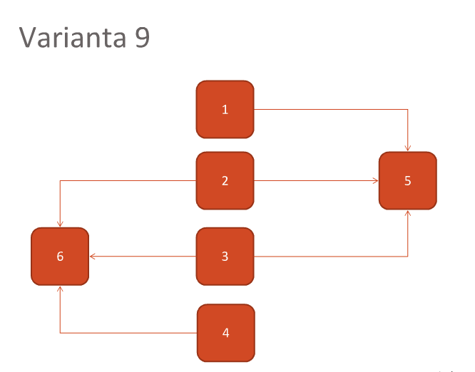

# Multithreading

**Task**

## How it works

For this problem, I used the `Event` object provided by python. It has 2 main functions: `event.wait()` and `event.set()`.

I created a class `MyTask` with the following constructor:
~~~python
def __init__(self, action, events_to_wait, event_to_set):
~~~

It also has a `run()` method:
~~~python
def run(self):
    # Wait for all required events
    for event_to_end in self.events_to_wait:
        event_to_end.wait()

    # Run action
    self.action()

    # Set that it's ready
    self.event_to_set.set()
~~~

Where:
  * action - a lambda
  * events_to_wait - the events to wait before executing the action
  * event_to_set - the event to set after action is done

The tasks are created in the following way:
~~~python
tasks[0] = MyTask(
    lambda_print('task1'),
    [task_events[4]],
    task_events[0])

tasks[1] = MyTask(
    lambda_print('task2'),
    [task_events[4], task_events[5]],
    task_events[1])

tasks[2] = MyTask(
    lambda_print('task3'),
    [task_events[4], task_events[5]],
    task_events[2])

tasks[3] = MyTask(
    lambda_print('task4'),
    [task_events[5]],
    task_events[3])

tasks[4] = MyTask(
    lambda_print('task5'),
    [],
    task_events[4])

tasks[5] = MyTask(
    lambda_print('task6'),
    [],
    task_events[5])
~~~

`task_events` is an array with `Event` objects, each event corresponding to a task.

### Lock

Because printing can't be done in the same time from multiple threads, it has to be locked:

~~~python
def my_print(some_str):
    with print_lock:
        print(some_str)
~~~

## Outputs
~~~
task5
task1
task6
task2
task3
task4
~~~

~~~
task5
task6
task1
task2
task4
task3
~~~

~~~
task5
task6
task1
task4
task3
task2
~~~
