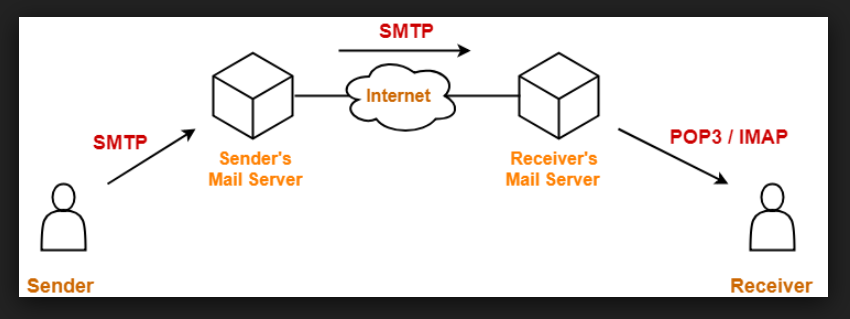
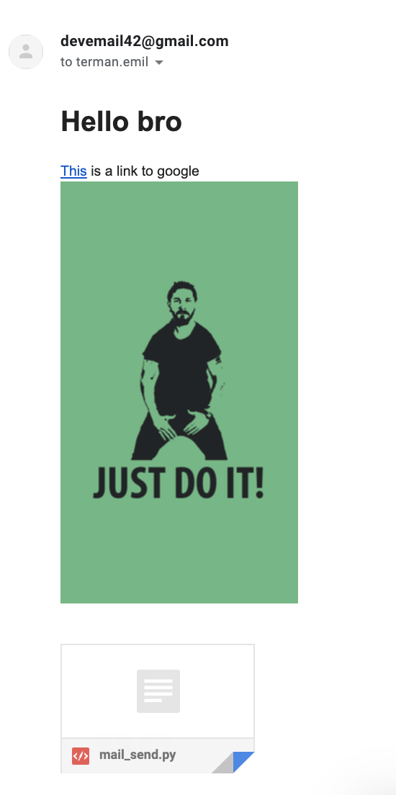

# Network Programming Laboratory Work Nr.4

## Prerequisites
  * SMTP - Simple Mail Transfer Protocol
  * POP3 - Post Office Protocol 3

## Objectives
  * Understand the SMTP protocol and the basic methods
  * Initialization the properties for SMTP Protocol
  * Using the real mail account/fake server for testing the mail sending functionalities
  * Basic concepts of SMTP/POP3 - Protocols

## Task
Read/Send an email using the SMTP and POP3 protocols

## How it works

### Mail sending

How to run the `mail_send.py`

~~~sh
python mail_send.py \
--email       "devemail42@gmail.com" \
--password    "%Is9R~lvJ5'ljOU{0wg?" \
--to          "terman.emil@gmail.com" \
-subject      "Some subject" \
--body        "$(cat ./helpers/sample_hypermsg.html)" \
--attachment  'mail_send.py'
~~~

**sample_hypermsg.html:**
~~~html
<h1>Hello bro</h1>

<a href="https://www.google.com">This</a> is a link to google
 

~~~

### Mail reading

Sample output:

~~~
Subject: Testing mail_read.py
From: Emil Terman <termanemil@gmail.com>
To: devemail42@gmail.com
Body: It seems that it's working

Headers: ----------------------------------------------------------
Delivered-To: devemail42@gmail.com
Received: by 2002:a67:7f4b:0:0:0:0:0 with SMTP id a72csp3337862vsd;
        Mon, 8 Apr 2019 03:03:11 -0700 (PDT)
X-Received: by 2002:a9d:12a2:: with SMTP id g31mr19414159otg.174.1554717791871;
        Mon, 08 Apr 2019 03:03:11 -0700 (PDT)
ARC-Seal: i=1; a=rsa-sha256; t=1554717791; cv=none;
        d=google.com; s=arc-20160816;
        b=KlW80UBjzzGPbtT9Yne00LKrMLStCSGzqfo3+iiO9lz/tAgE+9PkNJ1o6eHYpanTg1
         gA2d/0ysL8hKhc1KNm+fcw/3vAKs4AM/Q3ajesYX1Dp8gUkhpqDg50eqZL2dSfr/w/ql
         voqEm0p1o5klPKuuYm7cgzbpSy0LmRg+1ZkEphSql4zPOFP0cDeV0ePECfTl1X3GMj5D
         BU4eNOXKCEOOGhbfHZxnbh/3sZKz63RwMnExqiLvWNdcTKBnsVb/gYi4Va0bRONKd7zL
         EnNYQSeT1Tx+hp4GysRVuTnB3Hxa5FsgCJFZ0gfVgJL9YfxsM1x7sYEMfEQk0FczQXIz
         VHZA==
ARC-Message-Signature: i=1; a=rsa-sha256; c=relaxed/relaxed; d=google.com; s=arc-20160816;
        h=to:subject:message-id:date:from:mime-version:dkim-signature;
        bh=lq2XVBGGNtO0sf/U4duSGJQPmbeXAcTZy95LNBPwd7Y=;
        b=xUHR62ETdobtzi+IVIc0ObXBDzPcGPgqCua28mbqsHGdYISG3wY+6aQxz516qdCAsR
         53OVYIK+Z6CCRSiuzjJZp0l/pckSdGetygl6dbkJhRxpgpElLgV29DH6u6CzOhMH/m90
         CRHK3Gmw4VeBgoA4ZGklDmGa79NFLtnxWrgWW4aXyz8uBsOmd+CzfIeVF/3heX6390vQ
         H7TZfDvBMay7RLl2HHSV/1O+jfVpaacOrMENregosUqM/qJmJ0zVA09RiVreSOy/xNBu
         GnnQ+4hzBM4TfTDyNXYrcNucF4x/BdmRF223MCHVj+hVd7jq+nnDgghmD9NYhqdLsA0P
         bouw==
ARC-Authentication-Results: i=1; mx.google.com;
       dkim=pass header.i=@gmail.com header.s=20161025 header.b=LPCongZk;
       spf=pass (google.com: domain of termanemil@gmail.com designates 209.85.220.41 as permitted sender) smtp.mailfrom=termanemil@gmail.com;
       dmarc=pass (p=NONE sp=QUARANTINE dis=NONE) header.from=gmail.com
Return-Path: <termanemil@gmail.com>
Received: from mail-sor-f41.google.com (mail-sor-f41.google.com. [209.85.220.41])
        by mx.google.com with SMTPS id p125sor11265376oia.109.2019.04.08.03.03.11
        for <devemail42@gmail.com>
        (Google Transport Security);
        Mon, 08 Apr 2019 03:03:11 -0700 (PDT)
Received-SPF: pass (google.com: domain of termanemil@gmail.com designates 209.85.220.41 as permitted sender) client-ip=209.85.220.41;
Authentication-Results: mx.google.com;
       dkim=pass header.i=@gmail.com header.s=20161025 header.b=LPCongZk;
       spf=pass (google.com: domain of termanemil@gmail.com designates 209.85.220.41 as permitted sender) smtp.mailfrom=termanemil@gmail.com;
       dmarc=pass (p=NONE sp=QUARANTINE dis=NONE) header.from=gmail.com
DKIM-Signature: v=1; a=rsa-sha256; c=relaxed/relaxed;
        d=gmail.com; s=20161025;
        h=mime-version:from:date:message-id:subject:to;
        bh=lq2XVBGGNtO0sf/U4duSGJQPmbeXAcTZy95LNBPwd7Y=;
        b=LPCongZkT+8Cw8gQxhovYcYVE+xBFBs9bfz3p+ExVqrAZhMc0dH+/lXsyOEBOBepBH
         aYqZ0oxEqpKXq2X0Pylhk+csueHU1ZAWcBQvtMiet5d0++gaZwPpkI1Up57ml7wKv1iN
         8xu900VOd621L91vVIs7BCQatvLSJSCV2yRJm/cF5PIxJez2zX0DCZ20xXjB9yU//hBs
         pE2YDnOIQE/39J/5Cgok82Q/EzQCTGN5WoPxqJQyBC9i3YinSR4MmIAuHPVTkVY5PLiH
         DsPZ+Oocd5zr80/+tBNDLlBwVb1gUCklyE2w8UYwz5a5oekuqtKvRB2rthnuF2TBEgBh
         v4Wg==
X-Google-DKIM-Signature: v=1; a=rsa-sha256; c=relaxed/relaxed;
        d=1e100.net; s=20161025;
        h=x-gm-message-state:mime-version:from:date:message-id:subject:to;
        bh=lq2XVBGGNtO0sf/U4duSGJQPmbeXAcTZy95LNBPwd7Y=;
        b=l/klfkx8NGGo/pGCXO0RD2xsSm1BNPs0C+QPIe+K4QwYpbY5D74C3/IxopnUUjRJN8
         Ggg0At6o05e62BGTPc5JEhvm6CJoDbbl3opQU2nhC9R54U8GOru7zC6dB/knAuD5w63g
         Q4AtppkvmoSeqQIm2IAYygv8gxEF/7G8MH3f5E5ECEXrb+PymMDNEE0AeVC74N3RI0lf
         pi+aknAnLb2XV4jt3ezVywPX2ykf099plheGN+MTzfvMb7ZRnGxSxcK65kJTa4JBeE8F
         i0h6gqIA6XMwVcx4DHF+RaBs305QBJUGswjtWTmc+9I8bGR387PhGVsxlFjHSXJ5wkpu
         gkUg==
X-Gm-Message-State: APjAAAXQJ80Z6MwhLVhXyOyDGVKfIl+v9thG4T2+fSjO5jCJ45cj1xCr
	MF8oS7NJMCQBgCSKdXU5yE3XNbpxM8g5DhRkdU/Bhfb0
X-Google-Smtp-Source: APXvYqy52+muuR14ZItutgzTwyt4gkSJGRIIN6y6VuXQpg0rNYf414rW+5mQOitcoeRlZtVBmlc/AtS2ArbhsT7Sbt8=
X-Received: by 2002:aca:32c2:: with SMTP id y185mr16534018oiy.177.1554717791354;
 Mon, 08 Apr 2019 03:03:11 -0700 (PDT)
MIME-Version: 1.0
From: Emil Terman <termanemil@gmail.com>
Date: Mon, 8 Apr 2019 13:03:00 +0300
Message-ID: <CA+w+g2eBv3hDL4Q8842f+aLsocxnZfCb8RZZ=RRw=eJaeBs36Q@mail.gmail.com>
Subject: Testing mail_read.py
To: devemail42@gmail.com
Content-Type: multipart/alternative; boundary="000000000000ae062e058601f1c5"
~~~

## Conclusion
POP3's headers are useful for detecting spam emails for example
