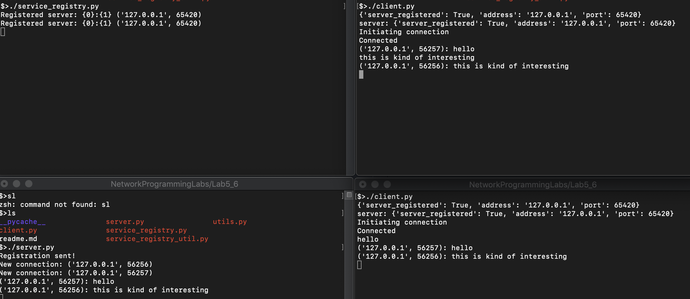

# Lab 5 & 6

## General description
A simple console chat where multiple clients can connect to a server and have a conversation.

But there's a problem: we always need to tell the clients where the server is located: we always need to provide the client an IP and a port.

To solve this problem, there's another "server" at a predefined port called Service Registry. When the server is run, it sends an UDP broadcast message telling everyone that a Chat Server has been started at a specific IP and port. The Service Registry then, registers this server. When a client tries to connect, first it asks the Service Registry where he can find a server to connect to, only after that, it establishes a TCP connection.

## Downsides
Since it's an UDP message, it's harder to guarantee that the messages have been received. For this, a different strategy must be applied.
